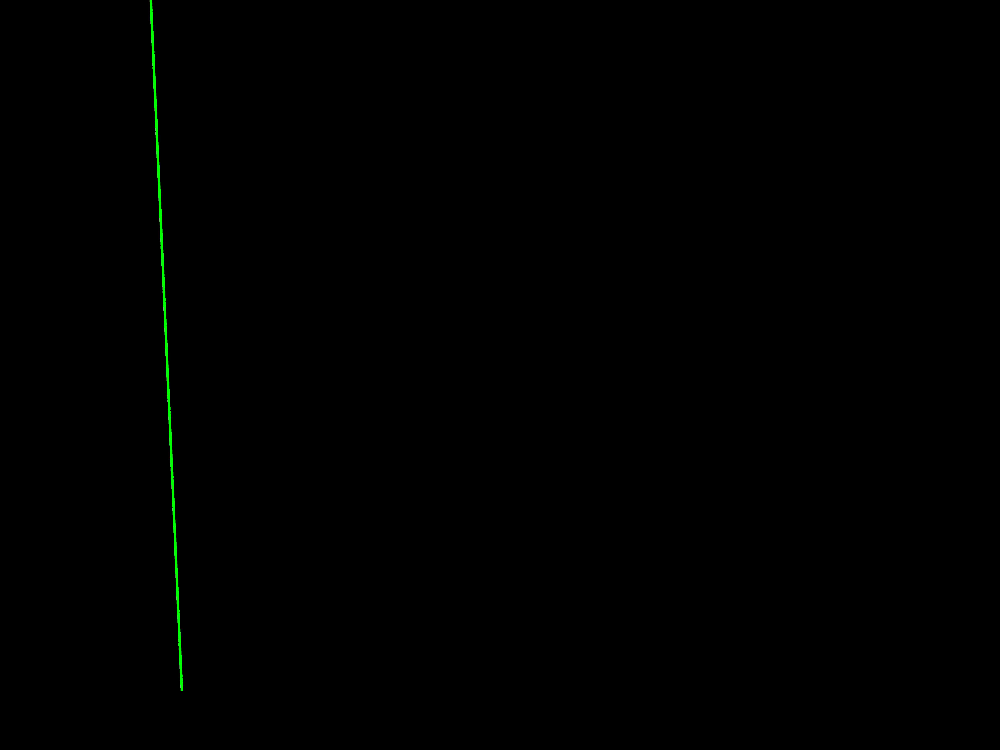
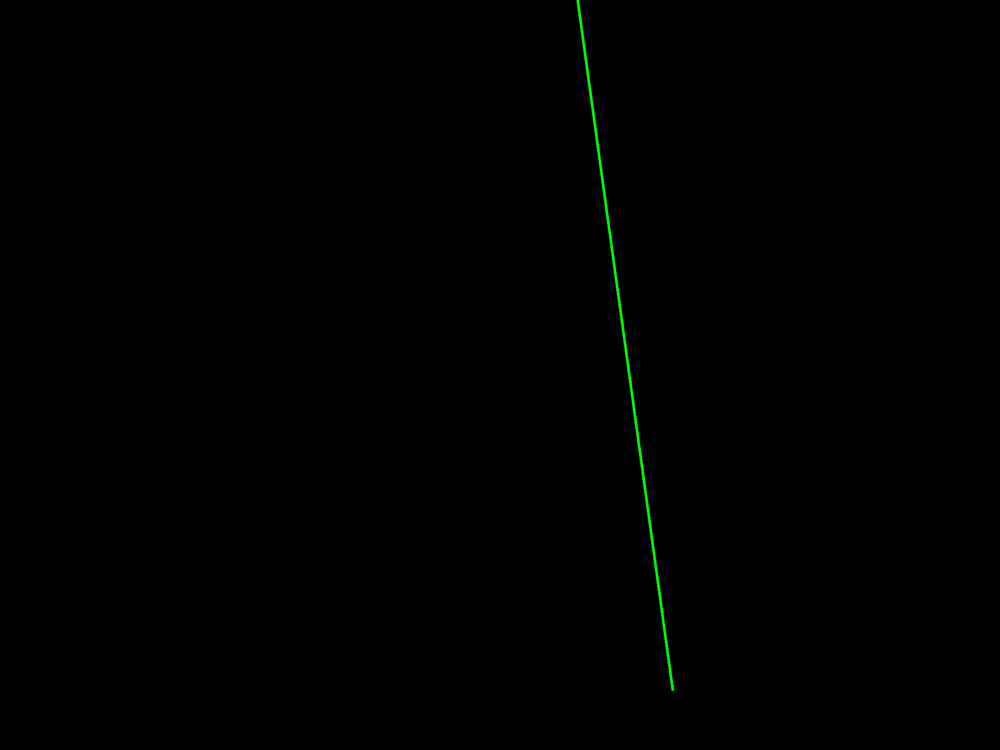

# Apaler
Laser strike geolocation system


## Project structure

    .
    ├── dataset                 # Datasets (synthetic, testdataset, jince, fit, etc.)
    ├── src                     # Source files
        ├── dataset             # Exploring contents of dataset files
        ├── detection           # Experimenting with different detection methods
        ├── localization        # Algorithm for localizing laser source
        └── testdataset         # Generation and evaluation on a testdataset 
    ├── README.md               # Contents of this file
    ├── bestparams.py           # A script that finds the best params of the rotlinedet
    ├── evaluate.py             # Runs evaluation on a testdataset
    └── requirements.txt        # Package requirements 

## Test dataset

The test dataset is used for evaluating laser detection algorithms.

### Generation
The dataset is generated by `src/testdataset/generation/dataset.py`
using images located in `dataset/testdataset/images/` and specified settings.
Make sure the resolution of images is the same as the supported resolution of detection 
algorithms (Rotlinedet is currently set up to work with Full HD images).

### Evaluation

Running `evaluate.py` in the root directory runs evaluation of the detection algorithmm.

The `evaluation.py` script contains logic for evaluation of the given detection
algorithm on all generated images in `dataset/testdataset/i*`. 
The number after the character `i` specifies the intensity of 
the laser, meaning that this value was added to pixels where the laser is present.

**Modify the `evaluate.py` script in the root directory to evaluate a different 
detection algorithm.**

### Best parameter selection of Rotlinedet algorithm

The dataset can be used to find the best parameters for the Rotlinedet algorithm
using the `bestparams.py` script, which runs evaluation for different parameters
and prints the best ones.


## Localization

Laser origin localization means finding the 3D coordinate of the beginning of the laser on Earth's surface.
Localization requires at least two images from cameras at different positions.

Laser origin is localized as follows:
* the laser is detected in each image
* the line together with the camera position represent a plane in world coordinates
* intersection of the planes is found, resulting in a line in world space
* the line is intersected with the earth's surface, resulting in a single point in world coordinates, 
which is the laser origin

### Implementation 

All source files regarding laser origin localization are present in the `src/localization/` folder.

For testing purposes, a `data_generation.py` script was created 
to generate `synthetic` images with lasers (black images with clearly visible lines).
As can be seen in the mentioned source file, certain camera parameters must be known for localization—position, 
image resolution, orientation, focal length, and pixel size.

The following images are generated, each showing the same laser from a different camera setup:
<p float="left">
    
    
</p>

The localiation is perfomed by `laser_source.py`, which reads two images,
finds lasers in the synthetic images using HoughTransform (for now), and 
determines the laser origin. 

Running the script prints the position of the laser origin in meters:
```
Laser source:  Position(2798.5569089625533, 6598.694271160422, 500.0)
```
which is close enough to the ground truth position of `Position(2800, 6600, 500)`.